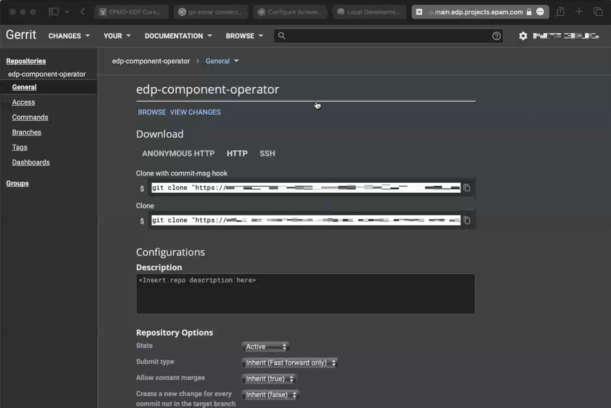
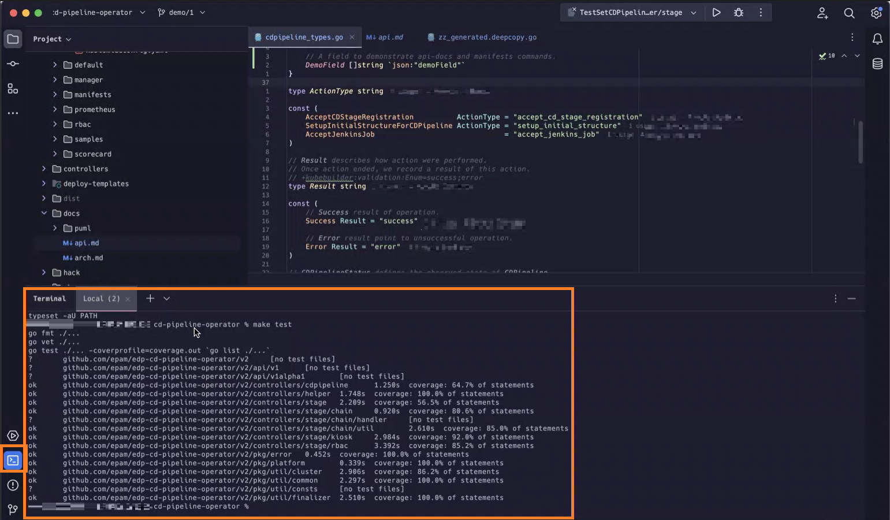
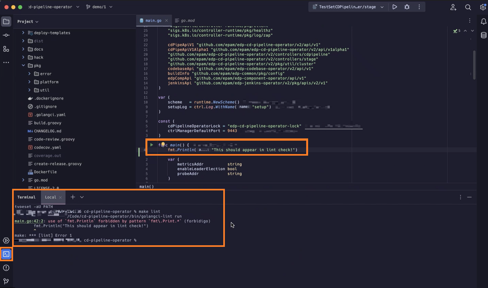
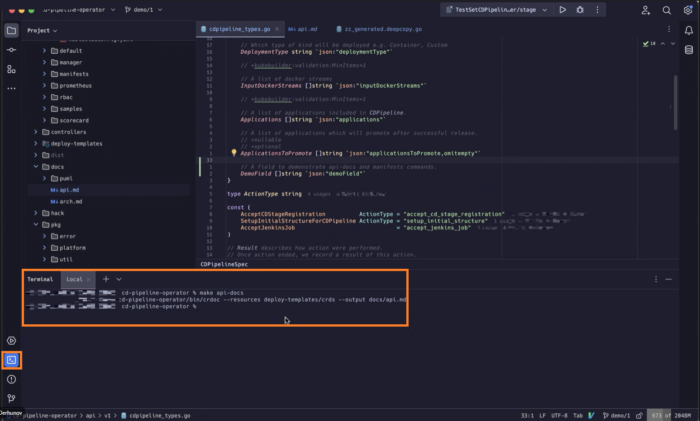
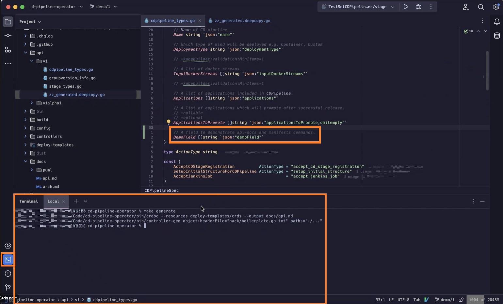

# Workspace setup manual

This manual is tailored specifically for those who work at EPAM internally and start dealing with EPAM Delivery Platform.

## Pre-requirements

* [Git](https://github.com/git-guides/install-git);
    
* [Docker](https://docs.docker.com/engine/install/);

* [Kubectl](https://kubernetes.io/docs/setup/);

* Local Kubernetes cluster ([Kind](https://kind.sigs.k8s.io/) is recommended);

* [Helm](https://helm.sh/docs/intro/install/);

* [GoLang](https://go.dev/dl/) stable version;

!!! note
    Make sure GOPATH and GOROOT environment variables are added in PATH.

* Any IDE ([GoLand](https://www.jetbrains.com/go/) is used here as an example).

!!! note
    According to license agreement, GoLand requires purchasing license for the IDE to leverage it for production purposes. So either buy it on your own or request activation code from EPAM [here](https://kb.epam.com/display/EPMSAM/Go+Developer)

## 1. Pull Operator

To start from, a code repository is needed. Ask other project members (let's say your team lead) to provide you with Gerrit account and link to be able to access to repository and clone the code.

!!! note
    Login to GlobalProtect VPN account first before accessing Gerrit page.

Open the link to Gerrit. Click the "Sign in" button and in a login page select "access-epam". The system should automatically pull your account and access to the main menu. Browse the git repositories available and clone the one that is needed with commit-msg hook. Don't close the tab after cloning the repo.

The procedure of generating commit-msg hook described [here](https://kb.epam.com/display/public/EPMDEDP/Gerrit+Setup+for+Developer).

## 2. IDE Setup

There is one thing needed in the Gerrit tab for further setup. Click the cogwheel button on the top right corner of the page and then move to "HTTP Credentials" tab. Navigate to "HTTP Credentials" section and then select "Generate new password". It's not a password for logging into the main menu but for the Gerrit Plugin is used by our IDE. Write down the password somewhere since it's going to be used soon.

Also, you should have your Docker, Kubernetes and Helm already setup before moving on.

#### 2.1 Installing plugins

The plugins described below significantly simplify the process of writing your code.
Kubernetes plugin provides you with useful information when dealing with Kubernetes manifests and Gerrit plugin adds UI menu for creating commits to your repositories and simplifies the commiting procedure.
Now move onto the IDE. The details pertaining activating Intellij IDEA are omitted. Go to the main menu.

!!! note
    Design may change when updating to new versions or installing some additional plugins that reorganize the menus. Nonetheless, the idea should remain the same.

So click on the settings icon at the top right corner, choose "Plugins" to display plugins menu, click to the search field at the middle of the menu and type "Kubernetes". Then click on the install button painted in green and wait till it gets installed. Do the same steps to install "Gerrit" pluggin.

!!! note
    Installing plugins requires the IDE restart so relaunch your IDE so save all your work if there was any first before installing pluggins.

#### 2.2 Adjusting plugins

Unlikely from Kubernetes plugin, which is supposed to be automatically configured when installing, Gerrit implies manual configuration. It needs the following fields to fill in:

* The link to your project Gerrit 

* Username in Gerrit

* "HTTP Credentials" password generated earlier

Don't forget to click "Test" to check if everything is allright.

After successful setup, pluggin screen can be invoked via  of the plugin you can leverage it to make commits:

#### 2.3 Go Build Configuration

Open folder in GoLand Intellij IDEA, click the  button and select the **Go Build** option:

In Configuration tab, fill in the following:

  1. In the Field field, indicate the path to the main.go file;

  2. In the Working directory field, indicate the path to the operator;

  3. In the Environment field, specify the platform name (OpenShift/Kubernetes);

!!! note
    Local development implies working with local Kubernetes clusters istead of EKS sandbox. Kind (Kubernetes in Docker) is recommended so set it or another environment first before starting running code and choose it here.

 

## 3. Pre-commit activities

Before making commit and sending it for review, take care of precautionary measures to avoid crashing some other parts of the code.

#### 3.1 Testing and linting

!!! note
    Testing and linting must be used before every single commit with no exceptions.

It is mandatory to run tests and lints to make sure the code passes the tests and meets acceptance criteria. For most operators, tests are already written so just run them by issuing these two commands:

      make tests && make lints

The command "make test" should output the following:

Also keep in mind that there is Sonarqube under the hood of EDP which checks newly generated code find out if the new code is covered enough by the tests or not. It requires at least 80% of the code to be covered by tests otherwise it causes errors in workflow.

This is how "make lint" works:

#### 3.2 Observe auto-generated docs, API and manifests

!!! note
    The commands "make api-docs", "make generate" and "make manifests" are especially essential when making changes to API. The code is not sufficient if these commands fail.

Generate documentation in .md format so the developer can read it.

      make api-docs

Refresh custom resource definitions for Kubernetes so that it allows the cluster to know which resources it deals with.

      make generate

There are also manifests within operator that generate zz_generated.deepcopy.go file in /api/v1 directory. Update it and check if it looks properly. 

      make manifests

This is how "make manifests" works:

That's it, you're all set! Good luck in coding.
