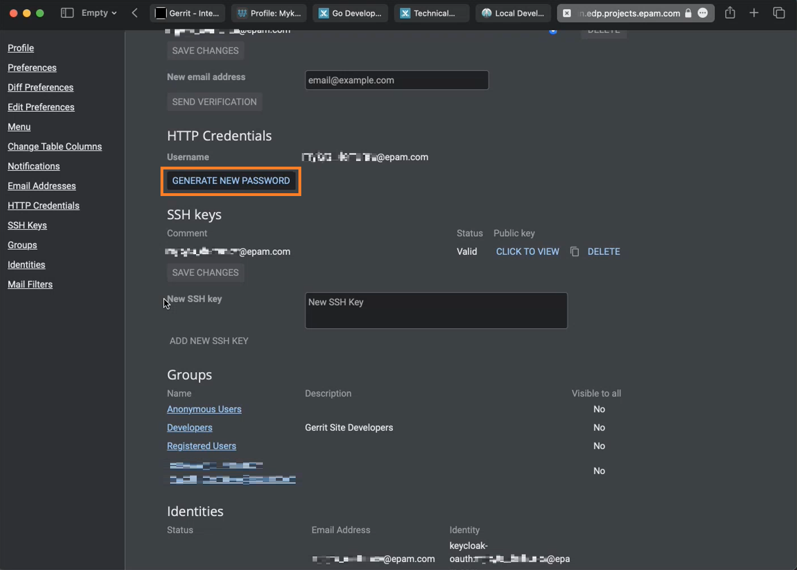

# Workspace setup manual

## Pre-requirements

It is highly recommended for you to use UNIX-like OS to diminish potential amount of ERRORs you will face during setup procedure.

* [Git](https://github.com/git-guides/install-git);
    
* [Kubernetes](https://kubernetes.io/docs/setup/) (requires [Docker](https://docs.docker.com/engine/install/) installation beforehand)

* [Helm]()

* [GoLang](https://go.dev/dl/) version higher than 1.13;

!!! note
    Make sure GOPATH and GOROOT environment variables were added in PATH.

* [GoLand Intellij IDEA](https://www.jetbrains.com/idea/download/#section=mac) or another IDE.

!!! note
    According to license agreement, GoLand Intellij IDEA requires you to purchase the IDE to leverage it for production purposes. You have to either buy it on your own or request activation code from EPAM [here](https://kb.epam.com/display/EPMSAM/Go+Developer)

## Pull Operator

To start from, you need a repository with code to work with. To get the link to the repository you need to clone you need to ask other project members (let's say your team lead) to provide you with Gerrit account so that you'll be able to access to repository. Ask your team lead for the link to private gerrit open it.

!!! note
    Accessing Gerrit page will require you to get logged in to GlobalProtect VPN account.

So once you're under VPN and opened the link to Gerrit you're supposed to see the following:

Click the "Sign in" button and in a login page select "access-epam":

!

The system should automatically pull your account and access you to the main menu:

  !

Now you can browse the git repositories available and clone the one you need with commit-msg hook.

The procedure of generating commit-msg hook described [here](https://kb.epam.com/display/public/EPMDEDP/Gerrit+Setup+for+Developer).

## IDE Setup

#### 1. Prerequisites

Now that we have accessed the main menu and cloned the repo there is one thing that will be needed during further setup. Let's click the cogwheel button on the top right corner of the page and then move to "HTTP Credentials" tab. Once you end up in the "HTTP Credentials" section click "Generate new password". It's not a password for logging into the main menu but for the Gerrit Plugin we will use in our IDE. Write down the password somewhere since we will use it soon.

Also, you should have your Docker, Kubernetes and Helm already setup before moving on.

#### 2. Installing plugins

In general, the plugins described below are not a requirement for you to perform your work with. But they significantly simplify the procedure of writing your code so you wouldn't regret you spent some time on this part of documentation.
Kubernetes plugin will provide you with useful information when dealing with Kubernetes manifests and Gerrit plugin will add a UI menu for creating commits to your repositories so that may significantly simplify the commiting procedure.
Now then, we can move onto the IDE. We will omit details pertaining activating Intellij IDEA and immediately jump in to the main menu.

!!! note
    Design may change when updating to new versions or installing some additional plugins that reorganize the menus. Nonetheless, the idea should remain the same.

So click on the cogwheel at the top right cornet, choose "Plugins" so the plugins menu will appear, click to the search field at the middle of the menu and type "Kubernetes". Then click on the install button painted in green and wait till it gets installed. Do the same steps to install "Gerrit" pluggin.

!!! note
    Installing plugins requires you to relaunch your IDE so save all your work if there was any first before installing pluggins.

#### 3. Adjusting Gerrit plugin

Unlikely from Kubernetes plugin, which is supposed to be automatically configured when installing, Gerrit implies you to configure it manually. What you should specify in your plugin setting is:

* The link to your project Gerrit 

* Your username in Gerrit

* "HTTP Credentials" password we generated earlier

This should look like on the picture below:

Don't forget to click "Test" to check if everything is allright.

After successful setup of the plugin you can leverage it to make commits:

#### 4. Go Build Configuration

Open folder in GoLand Intellij IDEA, click the  button and select the **Go Build** option:

In Configuration tab, fill in the following:

  1. In the Field field, indicate the path to the main.go file;

  2. In the Working directory field, indicate the path to the operator;

  3. In the Environment field, specify the platform name (OpenShift/Kubernetes);

That's it, you're all set! Good luck in coding.

## Pre-commit activities

Before making commit and sending it for review, you should take care of precautionary measures to avoid crashing some other parts of the code.

#### 1. make test and make lint

!!! note
    These two commands must be used before every single commit with no exceptions.

You must always make tests and lints to make sure your code passes the tests and meets acceptance criteria. For most operators, tests already were written so you can run them.

The command make test should output the following:

Also keep in mind that there is Sonarqube under the hood of EDP which will check your newly generated code find out if your new code is covered by the tests or not.

Now let's see how make lint works:

#### 2. make api-docs 

!!! note
    api-docs, make generate and make manifests are especially essential when making changes to API. These commands will fail the process if they aren't succeeded.

"api-docs" generates documendation in .md format so the developer can read it.

#### 3. make generate

"make generate" will refresh custom resource definitions for Kubernetes so that it will know which resources we're working with.

#### 4. make manifests

There is also a manifests within your operator that generates zz_generated.deepcopy.go file in /api/v1 directory. This is how make manifests works:

It is also worth checking if the file was tailored properly, it should look like it's shown below:

## Exceptional Cases

#### Case 1 

When using Windows OS and after starting the Go build process, the following error may appear:

        go: finding github.com/openshift/api v3.9.0
        go: finding github.com/openshift/client-go v3.9.0
        go: errors parsing go.mod:
        C:\Users\<<username>>\Desktop\EDP\edp-admin-console\go.mod:36: require github.com/openshift/api: version "v3.9.0" invalid: unknown revision v3.9.0

        Compilation finished with exit code 1

To resolve the issue, update the go dependency by applying the Golang command:

        go get github.com/openshift/api@v3.9.0

#### Case 2 

If Kubernetes plugin doesn't work automatically, make sure that it has the following configurations:

